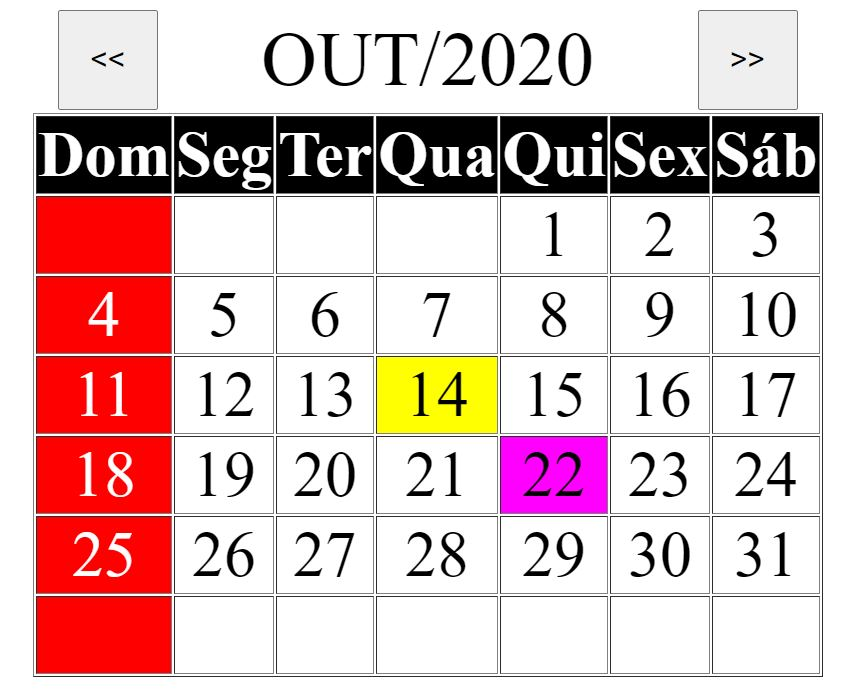
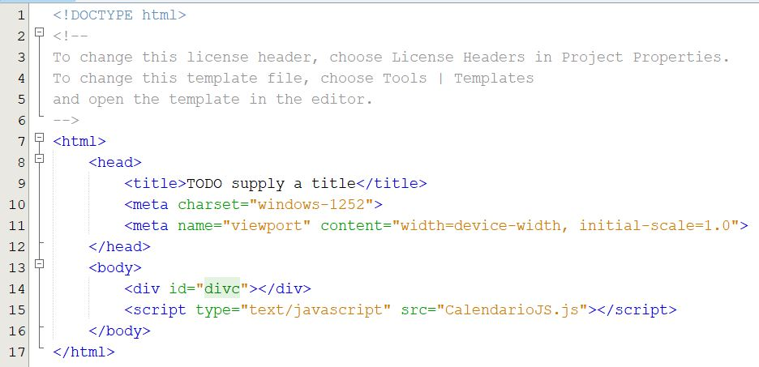

# calenadarioJS

## Usando

### Baixar o arquivo

Baixe o arquivo JS (javascript) ***CalendarioJS.js*** e salve o arquivo na mesma pasta do arquivo HTML que deseja inserir o calendário.

### Inserindo o componente que irá reproduzir o calendário

Inseria no HTML uma tag ***div*** com o atributo ***id*** igual a "divc", conforme exemplo abaixo.

> 

### Inserindo códigos na página (inline)

No arquivo HTML, como no exemplo abaixo, basta inserir a seguinte linha:

> 

Conforme foi inserido na ***linha 15*** do código de exemplo.

### Conclusão

O objetivo desse repositório é também auxiliar para utilização no desenvolvimento de aplicações que utilizam linguagem de hipertexto de maneira mais personalizável, tais como ***ANGULAR, IONIC, REAC, VUE etc***, pois o código pode ser facilmente importado no index.html desses framework e ajustado nas classes ts ou js que renderiza as páginas web.

Caso o usuário queira realçar datas de uma base de dados no calendário, por exemplo, basta seguir a analógia da função ***marcarHoje***, que é chamada na função ***criarCalendário***, e criar outras funções para alterar os estilos das células.

Caso o usuário queira adicionar outras funções para serem chamadas no click da célula selecionada, basta criar as funções e chamar dentro da função ***preencherLinha***, está função já adiciona um evento de click que alterar a cor da célula, chamando a função ***preencherCelulaSelecionada***. Outros eventos javascript também podem ser chamados, basta seguir o exemplo da sintaxe.
