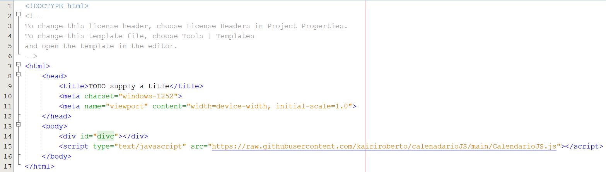

# calenadarioJS

## Usando

### Baixar o arquivo

Baixe o arquivo CalendarioJS.js e salve o arquivo na mesma pasta do arquivo HTML que deseja inserir o calendário.

### Inserindo o componente que irá reproduzir o calendário

Inseria no HTML uma tag ***div*** como ***id*** divc, conforme exemplo abaixo.

> 

### Inserindo códigos na página (inline)

No arquivo HTML, como no exemplo abaixo, basta inserir a seguinte linha:

> 

Conforme foi inserido na ***linha 15*** do código de exemplo.

